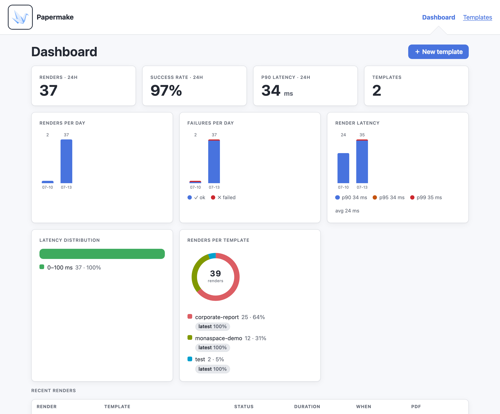

<p align="center">
  
</p>

# Papermake

**A self-hosted rendering service for [Typst](https://typst.app/) documents.**

Papermake turns Typst templates into HTTP APIs. Publish a template once, send
JSON data to render it, and fetch the resulting PDF by render id. Templates,
rendered PDFs, input data, and analytics live in S3-compatible object storage.

<p align="center">
  
</p>

## Why Papermake

- **Manages and versioned templates:** store document templates as immutable, versioned
  content-addressed bundles.
- **Server-side rendering:** Typst runs on the server; clients only send data and
  download PDFs.
- **Lightning fast:** A typical document renders in under 100ms.
- **Render individually or as batch:** Render one document on demand or submit
  thousands of inputs as a batch job and collect the PDFs as they complete.
- **Support multiple PDF Standards:** besides PDF1.7 you can also generate Archival PDFs in PDF/A-2, PDF/A-3, PDF/A-4 and PDF/UA-1
- **Built-in history and analytics:** record render volume, success rate,
  latency, recent renders, and per-template activity.
- **Retention controls:** expire rendered outputs globally, per template, or per
  render.
- **Simple self-hosting:** run the API, web UI, worker, and local object store
  with Docker Compose.

## Quick Start

```bash
git clone https://github.com/jpraetorius/papermake
cd papermake
docker compose up -d
curl http://localhost:3000/health
```

Then open **http://localhost:3000/** to publish a template and test-render it
from the web UI.

For a guided first render with `curl`, follow
[Getting started](docs/tutorials/getting-started.md).

## Documentation

- [Getting started](docs/tutorials/getting-started.md) - from zero to a rendered PDF.
- [Writing templates](docs/how-to/templates.md) - data injection, schemas, assets,
  imports, fonts, PDF standards, and tags.
- [Batch rendering](docs/how-to/batch-rendering.md) - submit many inputs,
  monitor the job, and collect the resulting PDFs.
- [Operations](docs/how-to/operations.md) - scale workers, inspect incidents,
  rotate credentials, and back up S3 data.
- [HTTP API reference](docs/reference/api.md) - endpoints, request bodies, responses, and
  error behavior.
- [Configuration reference](docs/reference/configuration.md) - environment variables by process.
- [Template reference](docs/reference/templates.md) - reference strings,
  manifests, metadata, schemas, bundle paths, and fonts.
- [Analytics & retention](docs/explanation/analytics-and-retention.md) - how
  render history, rollups, expiry, and pruning work.
- [Security model](docs/explanation/security.md) - trust boundary, public
  exposure, Typst rendering assumptions, and operational safeguards.
- [Self-hosting](docs/how-to/self-hosting.md) - Docker Compose, running from source,
  environment variables, fonts, scaling, and storage layout.

## License & Attribution

Licensed under the **Apache License 2.0**; see [LICENSE](LICENSE).

This is a modified fork of
[papermake](https://github.com/rkstgr/papermake) by Erik Steiger. See
[NOTICE](NOTICE) for attribution.
